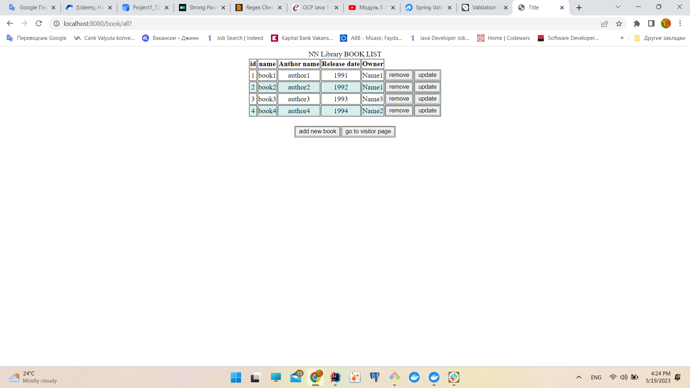
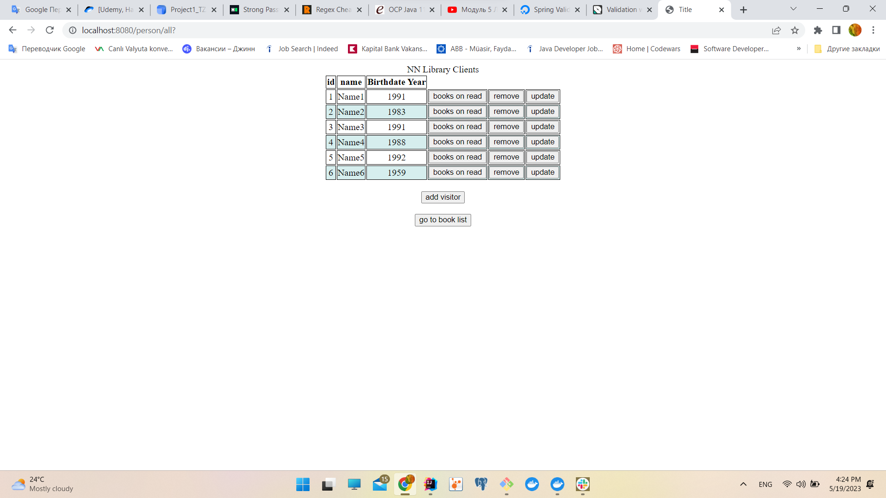

# This is CRUD project for library. You can add, update, and delete users and books for library.     
These instructions will help you with how to deploy the project and how to use the project.

## In the project we used:
- JDK version 17
- PostgresSQL 42.6.0
- Spring Framework 5.3.20
- Thymeleaf-Spring5
- Spring Validator
- HTML page

## How do I execute the project?
For deploying we should have the Docker.
All configurations for PostgresSQL and Tomcat are in docker-compose and dockerfile files.

To execute you must run these snips of code in the terminal:
- `docker-compose up`
> after this command click here for paging on the browser http://localhost:8080/book/all
- `docker system prune --volumes` (Don't use this snip of code if you did not make any changes. This line for cleaning
  containers from docker)

## When the project is deploying, and we see a page in browser
At the first time, you will see page for book list:
- You can add, update, and delete books.
- During adding or updating books or people if you did any mistakes in writing name or date for these
  you will face validation errors as shown pictures.
- You can add books for people. Here we have one-to-many relationship. Person able to has many books
  but book can be owned by one person. 

## Conclusion
> This project created on Spring JDBCTemplate

In project, I have N+1 problem in get all books method. I will resolve it in next time. 
